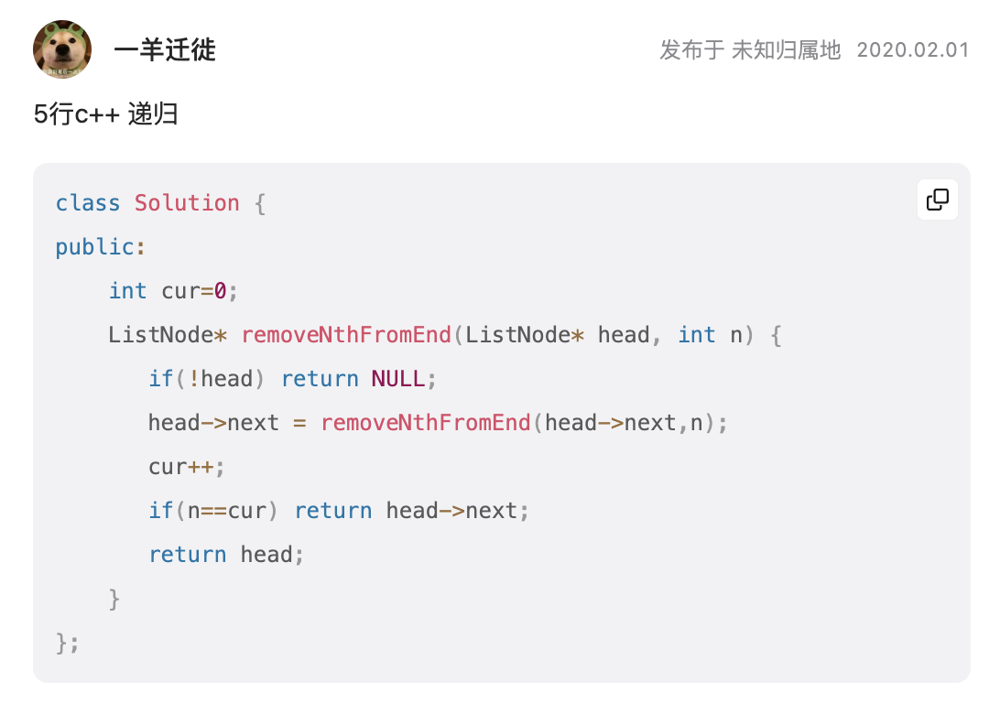

[删除链表的倒数第N个节点](https://leetcode.cn/problems/remove-nth-node-from-end-of-list/)

```c++
/**
 * Definition for singly-linked list.
 * struct ListNode {
 *     int val;
 *     ListNode *next;
 *     ListNode() : val(0), next(nullptr) {}
 *     ListNode(int x) : val(x), next(nullptr) {}
 *     ListNode(int x, ListNode *next) : val(x), next(next) {}
 * };
 */
class Solution {
public:
    ListNode* removeNthFromEnd(ListNode* head, int n) {
        ListNode* dummyHead = new ListNode();
        dummyHead->next = head;
        ListNode* left = dummyHead;
        ListNode* right = dummyHead;
        while (n--) {
            right = right->next;
        }
        while (right->next != nullptr) {
            left = left->next;
            right = right->next;
        }
        ListNode* deletenode = left->next;
        left->next = left->next->next;
        ListNode* result = dummyHead->next;
        delete deletenode;
        delete dummyHead;
        return result;
    }
};

// 思路，双指针，间隔为n，等到右指针到头时，左指针进行删除操作！
```

***

- 赞叹别人的想法

